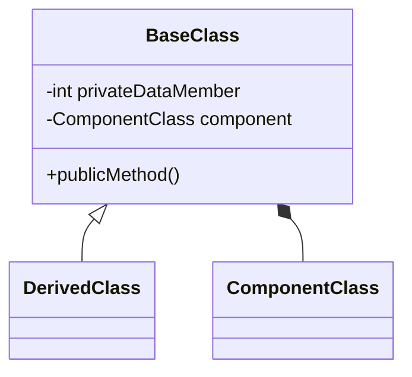

# Abstraction (10%)

Here you should describe how you have used Inheritance for Code Reuse in your solution.

You should use class diagrams and code snippets where appropriate.

Here is an example of a code snippet in markdown

```cs
/// <summary>
/// Prompts the user to enter an integer within a specified range.
/// </summary>
/// <param name="pMin">The minimum acceptable value (inclusive).</param>
/// <param name="pMax">The maximum acceptable value (inclusive).</param>
/// <param name="pMessage">The message to display to the user.</param>
/// <returns>An integer entered by the user within the specified range.</returns>
/// <exception cref="Exception">Thrown when the minimum value is greater than the maximum value.</exception>
public static int GetIntegerInRange(int pMin, int pMax, string pMessage)
{
  if (pMin > pMax)
  {
    throw new Exception($"Minimum value {pMin} cannot be greater than maximum value {pMax}");
  }

  int result;

  do
  {
    Console.ForegroundColor = ConsoleColor.Yellow;
    Console.WriteLine(pMessage);
    Console.WriteLine($"Please enter a number between {pMin} and {pMax} inclusive.");

    Console.ForegroundColor = ConsoleColor.Green;
    string userInput = Console.ReadLine();
    Console.ForegroundColor = ConsoleColor.Yellow;
    try
    {
      result = int.Parse(userInput);
    }
    catch
    {
      Console.WriteLine($"{userInput} is not a number");
      continue;
    }

    if (result >= pMin && result <= pMax)
    {
      return result;
    }
    Console.WriteLine($"{result} is not between {pMin} and {pMax} inclusive.");
  } while (true);
}
```

Here is an example of a class diagram in markdown


